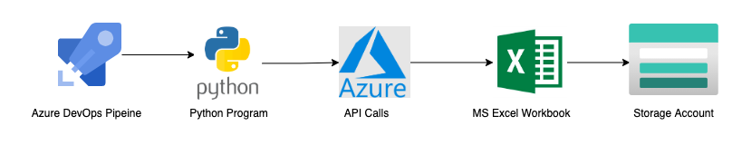
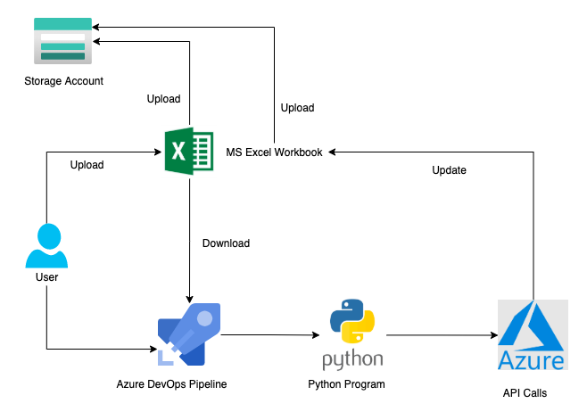

# Getting Started
To work on this project, you should have the git client and an editor (VS Code is free and capable)

If this is your first time using git, you will need to tell it your name and email address. This can be done using the following two commands (making the obvious changes)

`git config --global user.name "Your Name"`

`git config --global user.email you@example.com`

# Get Azure Tags

This process creates an excel file which contains tags of all resources, resource groups for a given subscription. The excel file is then pushed to a storage container in Azure using the same Azure DevOps Pipeline which generates the excel file.

## Prerequisites

1. An Active Azure Service Principle Credentials for authentication.
2. A Storage Account with Container for excel file storage.
3. Azure DevOps service Connection, repository, pipeline and Library (Variable Groups)

## Get Tags process summary

This is the general idea how the process works within the Pipeline and Python

1. Start the pipeline selecting the subscription name which triggers the python script with few arguments.
2. Login to Azure using the Service Principle credentials to generate the API tokens.
3. Query Azure API to get information about a scope i.e Subscription or Resource group or Resource.
4. Format and inserts the data into Excel Sheet.
5. Upload the excel file to Azure Storage Account Container.

# Update Tags process summary

This process updates (replaces) tags for any scope i.e Subscription or Resource group or Resource. It uses the excel file created in [get azure tags](#get-azure-tags) to run. You can modify the excel file values as per your requirement.

## Prerequisites

1. An Active Azure Service Principle Credentials for authentication.
2. A Storage Account with Container containing the excel file for updated tags. Refer to the excel file created in [get azure tags](#get-azure-tags) process.
3. Azure DevOps service connection, repository, pipeline and Library (Variable Groups)

## The process in summary

This is the general idea how the process works in Pipeline and Python.

1. Download the excel file created in [get azure tags](#get-azure-tags) process.
2. Edit the excel file to match your required tags.
3. Upload the file to the same storage account. You can change the name of the excel file.
4. Start the pipeline with the file name and date as variable while selecting the scope - Subscription or ResourceGroup or Resource.
5. The Pipeline :

    a. Download the file from storage account.

    b. Check for column values for updates

    c. Login to Azure using the Service Principle credentials to generate the API tokens.

    d. Query Azure API to patch the updates for updated tag and values.

## Update the Tags

### Update the excel file

Coming Soon..

### Verify the updated tags

Coming Soon..